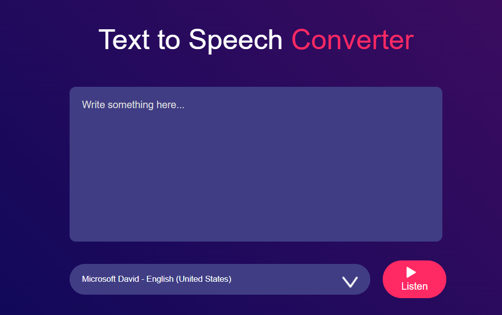

# 🔐 Text-to-Speech Converter

Transform written text into natural-sounding speech with just one click!
Whether you're building accessibility features, voiceovers, or just experimenting—this tool is perfect for you.

---

<!-- Project Link -->

🚀 **Try it now:** [Generate your passwords instantly!](https://text-to-voice-convertor-alpha.vercel.app/)

<!-- Project Image -->

<p align="center">
  
</p>

---

A simple and customizable Text-to-Speech Converter built with **HTML** **CSS** and **JavaScript**.

## ✨ Features

- 🗣️ Real-Time Voice Output: Converts text to speech instantly
🎛️ Customizable: Choose voice type and language
📋 Easy-to-Use: Clean UI
🌍 Multi-Language Support: Supports multiple languages and voices
📱 Responsive: Works seamlessly across desktop and mobile devices

## 🚀 Getting Started

### Installation

1. **Clone the repository:**
   ```bash
   git clone https://github.com/your-username/Text-to-Speech-Converter.git
   cd Text-to-Speech-Converter
   ```

2. **Running the App**

Start the development server:
```
    Go Live
```
Open [http://http://127.0.0.1:5500](http://http://127.0.0.1:5500) in your browser to get started!


## 📝 Usage

1. Enter or paste the text you want to convert.
2. Select the voice, language (optional).
3. Click the "Speak" button to hear the audio.
4. Use "Stop" to halt speech at any time.

## 🎨 Customization

- Modify available voice options and defaults in the source code.
- Adjust UI and styles through the React components and CSS files.
- Add additional language support as needed.

## 📄 License

This project is licensed under the MIT License.

---